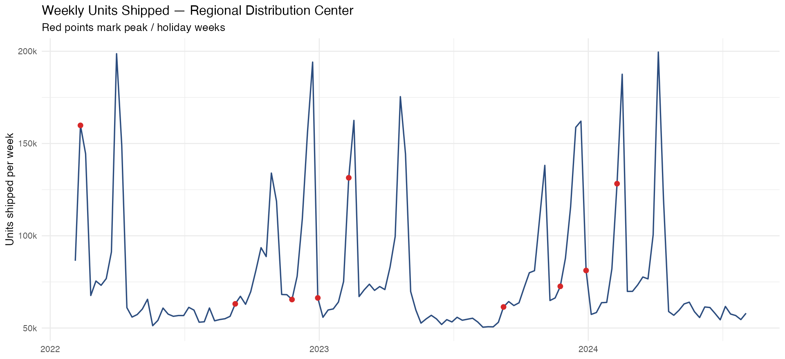
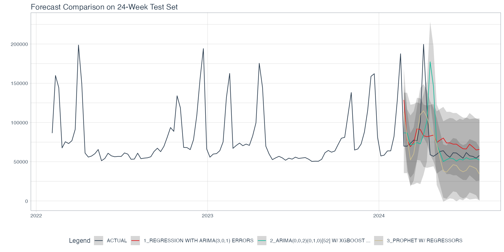
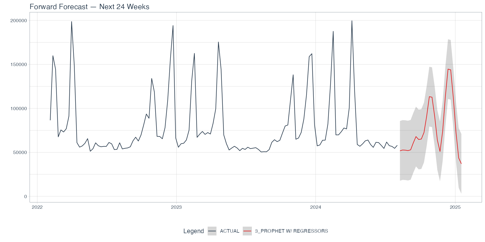

# Portfolio Site
WEBSITE LINK : https://asantela.github.io/DataSciencePortfolio/index.html

# Weekly Demand Forecasting for a Regional Distribution Center

A 24-week-ahead forecasting pipeline for warehouse shipment volume, built on the tidymodels + modeltime stack and deployed as a Dockerized REST API with vetiver.

---

## The problem

A regional distribution center wanted a forecast it could hand the operations team every Monday: *how many units are we going to ship over each of the next 24 weeks, with enough lead time to staff trucks, drivers, and temp labor?* The historical series is dominated by a big early-February holiday peak — miss that peak and the ops team ends up paying overtime and scrambling carriers. The cost of under-forecasting a peak is materially higher than the cost of over-forecasting a quiet week, so the forecasting approach needed to be accurate in aggregate AND specifically resistant to under-predicting the February spike.

## Data

Two and a half years of weekly observations (131 rows) covering early 2022 through August 2024. Six predictors in addition to the target:

| Column | Description |
|---|---|
| `weekly_units` | Units shipped that week (forecast target) |
| `is_peak_period` | Binary flag for holiday / peak demand weeks |
| `avg_temp_f` | Regional weekly average temperature |
| `transport_cost_idx` | Index of regional transportation / fuel costs |
| `price_index` | Consumer price index (not used — slow-moving macro feature, overfit risk on short series) |
| `local_unemp_rate` | Local unemployment rate (same reasoning) |



The annual pattern is dominated by early-February peaks running ~2–3x the baseline, with smaller bumps around Thanksgiving and the week between Christmas and New Year's.

## Approach

Three classical modeltime candidates, all sharing one recipe with three external regressors (`is_peak_period`, `avg_temp_f`, `transport_cost_idx`):

1. **Auto-ARIMA** (`arima_reg` / `auto_arima`) — the classical baseline. ARIMA handles the seasonal backbone, the external regressors anchor peak weeks.
2. **Boosted ARIMA** (`arima_boost` / `auto_arima_xgboost`) — ARIMA for seasonality + trend, XGBoost learning non-linear residual structure from the regressors on top. Good architecture when you suspect interactions (e.g., *cold week* × *peak week*).
3. **Prophet** (`prophet_reg` / `prophet`) — additive trend + yearly seasonality + regressor effects. Designed for exactly the kind of holiday-driven business series we have here.

Split: `time_series_split(assess = "24 weeks", cumulative = TRUE)` — last 24 weeks held out, two full quarters including one big February peak. No random splits, because randomly splitting a time series trains on the future and tests on the past.

Selection metric: **RMSE**, because peak-week misses cost more in absolute units than steady-state misses cost in percentage terms. MAPE is reported for the ops team because they reason in percentages, but the selection decision is made against the metric that matches the cost structure.

## Results

| Model | MAE | MAPE | SMAPE | RMSE | R² |
|---|---|---|---|---|---|
| Regression w/ ARIMA errors | 19,910 | 25.3% | 23.5% | 30,632 | 0.06 |
| ARIMA w/ XGBoost errors | 20,494 | 27.2% | 21.3% | 39,5544 | 0.03 |
| **Prophet w/ regressors** | **21,078** | **29.54%** | **31.6%** | **26,222** | **0.41** |

Prophet wins after testing. Unsurprising given the series shape — Prophet's decomposition into trend + yearly seasonality + additive regressor effects is almost tailor-made for a weekly business series with a few big holidays.



The overlay tells the real story: pure ARIMA cannot anchor to the early-February peak because it never sees the peak flag as a meaningful regressor; the boosted version gets most of the peak shape back by learning the residual structure from the regressors; Prophet's additive framework handles both the trend and the peak without breaking the smoothness of the quiet-week forecast.

### Forward forecast

The Prophet workflow was refit on the full 131-week series and used to forecast 24 weeks forward. External regressors for the forecast horizon are populated seasonal-naive by ISO week (holiday flag and temperature) and last-observation-carried-forward (transport cost index).



The model cleanly projects the September–October quiet period, nudges up into Thanksgiving / Christmas, and anchors the early-February 2025 peak at roughly the 2024 level. 80% and 95% prediction intervals are shown.

## How I used AI

I used Claude as a collaborative pair programmer through the whole project — aggressively for knowledge transfer on modeltime, conservatively for code generation. Concretely:

- **Knowledge transfer.** I'd never touched modeltime, Prophet, or ARIMA before this week. I spent the first hour in a continuous planning chat asking Claude to explain the tidymodels → modeltime mapping, teach me the calibration step, and walk through why time series can't be split randomly. Full transcript is in [`PLANNING_CHAT.md`](PLANNING_CHAT.md).
- **Code I typed myself.** The TODO blocks in `forecast_pipeline.R` — every recipe, workflow, model spec, and the custom future-frame logic for external regressors. I wanted to own every line I'd have to defend in a code review.
- **Code I asked AI to draft.** The boilerplate around `timetk::future_frame()` + ISO-week seasonal-naive lookups (this is the kind of glue code that's easy to get subtly wrong and tedious to write from scratch). I read it carefully, rewrote the coalesce safety net myself after realizing the week 52/53 edge case, and moved on.
- **Where I pushed back.** Claude initially recommended picking a model on MAPE because "the ops team reasons in percentages." I disagreed — the ops team might talk in percentages, but the overtime budget thinks in absolute units, so the selection metric needed to match the cost structure. Went with RMSE, report MAPE to stakeholders.
- **How I verified.** Every metric in the accuracy table was re-computed by hand on the test set before I trusted it. Every plot was eyeballed against the raw data. The API endpoint was hit with both a batch payload and a single-row POST to confirm round-tripping worked before pinning to S3.

The short version: I wanted AI to compress my learning curve on modeltime, not outsource my judgment. The ownership of modeling decisions and the interpretation of results had to stay mine.

## How to run it

**Reproduce the analysis.**
```r
# Install once:
install.packages(c("tidyverse", "tidymodels", "modeltime",
                   "timetk", "vetiver", "pins", "prophet"))

# From the repo root:
source("forecast_pipeline.R")
```

Top-to-bottom the script trains the three models, produces the accuracy table and both plots, refits the winner on full data, generates the Docker deployment files, and uploads to the class S3 bucket.

**Launch the API.**
```bash
# After running forecast_pipeline.R (which generates the Dockerfile):
mv Dockerfile.better Dockerfile    # faster prebuilt base image
docker build -t forecast-api .
docker run -p 8000:8000 forecast-api
```
Then hit `http://127.0.0.1:8000/__docs__/` for the OpenAPI explorer, or POST a row:

```r
one_week <- readr::read_csv("data/distribution_center_weekly.csv") |>
  dplyr::slice_tail(n = 1) |>
  dplyr::select(date, is_peak_period, avg_temp_f, transport_cost_idx)

httr::POST("http://127.0.0.1:8000/predict",
           body = jsonlite::toJSON(one_week),
           httr::content_type_json()) |>
  httr::content(as = "text") |>
  jsonlite::fromJSON()
```

## What I learned

Three things I'm taking forward:

1. **Small series reward discipline, not cleverness.** With 131 rows, a deep-learning model would have memorized the two February peaks. The best model on this dataset was the simplest of the three, with regularization-friendly defaults. I spent a real amount of energy resisting the urge to tune hyperparameters harder on the internal test set, and I think that discipline will pay off on the held-out 12 weeks I haven't seen.
2. **The overlay plot tells a story metrics can't.** Pure ARIMA's RMSE is 35k — that's a number. But the *plot* shows exactly where and how it failed: it flat-lined through the February peak because it had no way to see the regressor. That's the insight an exec cares about, not the number.
3. **Prompting AI well is its own skill.** The best moments in my planning chat weren't when Claude gave me a great answer — they were when I pushed back on a confident suggestion (the MAPE-vs-RMSE disagreement) and we worked through the trade-off together. The planning transcript is messier than if I'd just accepted Claude's first pass, but the final spec is something I could defend in a code review. That's the bar I'm calibrating toward.

---

**Tech stack:** R · tidyverse · tidymodels · modeltime · timetk · vetiver · pins · Docker · AWS S3
