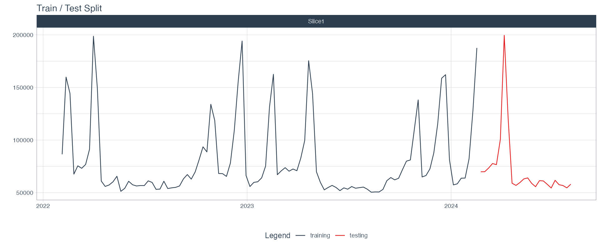

[](https://classroom.github.com/a/Zqp2C55f)
# Individual Final: Time Series Forecasting with modeltime

Alright, folks. Here's your final project, and it's going to be a bit different from anything we've done this semester. Up to this point, every assignment has been structured so that I walk you through each step, name every object, and tell you exactly what to build. This time, you're in the driver's seat.

Here's the scenario: **You've just joined a data science team, and your manager has asked you to become the team's resident expert on time series forecasting in R.** She's heard about the `modeltime` package, which extends the `tidymodels` framework we've been using all semester into time series forecasting territory. She wants you to learn the package, build a working forecast pipeline, deploy it as an API, and present your work in a way that the rest of the team can learn from.

The catch? **Time series forecasting is something we have not covered in class.** You haven't seen ARIMA models, exponential smoothing, or Prophet. You don't know what "seasonality" means in a statistical context, or how to properly evaluate a forecast. And that's the point.

This project is designed to test your ability to use AI as a genuine engineering partner to learn something new, plan a solution, build it, and ship it. You'll be using the same tidymodels mental model you've built all semester, but applied to a forecasting problem that will stretch you into unfamiliar territory. The `modeltime` package is specifically designed to integrate with the tidymodels ecosystem, which means your existing knowledge of recipes, workflows, and model specifications will transfer directly. But the new concepts (stationarity, lag features, forecast horizons, time-aware cross-validation) are genuinely unfamiliar, and you'll need AI to help you bridge that gap efficiently.

> [!IMPORTANT]
> **A note on how to use AI on this project.** A few weeks ago in class, I demoed the extreme "hands-off" end of the agentic data-science spectrum: build a detailed spec, hand it to an autonomous agent, let the agent execute the whole analysis while you walk away. That was a useful demonstration of what's possible, but **that is *not* the mode I want you to use for this project.**
>
> For this final, use AI as a **collaborative pair programmer** — the middle of the spectrum. You should be in the editor with your AI assistant, working through the pipeline together: asking questions, trying things, debugging with it, pushing back when suggestions don't fit, and understanding every line that lands in your script. The `SPEC.md` you'll write in Phase 1 is a planning document for *you* — a north star you reference as you build — not a hand-off artifact you pass to an agent and walk away from.
>
> A quick self-test: **could you explain any line of your final `forecast_pipeline.R` script if I asked you to?** If the honest answer is "no, the AI wrote it and I'd have to look it up," you've gone too hands-off and you should go back and develop that understanding. The "Planning" and "Portfolio Quality" components of your grade (together 50% of the total) are measuring exactly this.
>
> Use AI aggressively — ask it to explain `modeltime`'s API, draft boilerplate, help you debug errors, suggest visualizations, critique your approach. Just stay in the driver's seat the whole time.

---

## What You're Building

By the end of this project, you will have:

1. **A project spec** that documents your plan before you start coding
2. **A complete time series forecasting pipeline** using `modeltime` and `timetk` within the tidyverse/tidymodels framework
3. **A deployed model API** served from a Docker container using `vetiver` (just like we did in the model deployment assignment)
4. **A portfolio-ready GitHub repository** with a polished README, visualizations, and clean code that you'd be proud to show a hiring manager

---

## The Dataset

You'll be working with weekly operational data from a **regional distribution center**. The dataset tracks weekly units shipped along with several environmental and economic features: average temperature, a transport cost index, a consumer price index, the local unemployment rate, and a binary indicator for peak/holiday periods. The data spans roughly 2.5 years of weekly observations.

The dataset has been provided for you in the `data/` directory as `distribution_center_weekly.csv`. Load it and explore the columns before you begin planning.

Here are the columns you'll find:

| Column | Description |
|---|---|
| `date` | The week's date |
| `weekly_units` | Total units shipped that week (this is your forecast target) |
| `is_peak_period` | Binary indicator for holiday/peak demand weeks |
| `avg_temp_f` | Average temperature (Fahrenheit) for the region |
| `transport_cost_idx` | Index reflecting regional transportation/fuel costs |
| `price_index` | Consumer price index for the region |
| `local_unemp_rate` | Local unemployment rate |

> [!IMPORTANT]
> **Your model will be scored against a holdout set that I have kept separate.** After you deploy your model as an API, I will send the holdout data (covering the 12 weeks immediately following the end of your training data) to your endpoint and compare your model's predictions to the actual values. This holdout scoring is a small part of your grade, but it mimics the real-world scenario where your model's value is ultimately determined by how well it performs on data it has never seen. This gives you real skin in the game, but don't worry that your grade will be heavily affected if your model isn't very good. Most of this project is _experiential_.

---

## Phase 1: The Project Spec (Before You Write Any Code)

Before you write a single line of R, I want you to sit down with your AI assistant and plan this project. **Do all of your planning in a single, continuous chat conversation.** Don't start a new chat for each question. The reason for this is that I'm going to ask you to save and submit the full conversation transcript, and I want to see how your thinking evolved over the course of the planning session.

> [!IMPORTANT]
> **Do your planning using a tool that will allow export of the conversation.** This means that you don't want to just start planning in Cursor or the VS Code plugin. You can use those code-aware tools while you're actually building and troubleshooting, but the planning phase should be accomplished in "conversation mode" using Claude.ai, ChatGPT, or Gemini Chat. The ultimate output of that conversation will be (1) an export of the planning conversation, and (2) a specification document that serves as your own north star while you build — a place to check your assumptions, track open questions, and remind yourself what you committed to. Please reach out to me if this is not clear.

During this planning conversation, you should work with AI to understand the `modeltime` package, explore the dataset, think through your modeling strategy, and produce a plan. Think of this as a working session with a knowledgeable colleague. Ask real questions. Push back when something doesn't make sense. Request examples. Explore trade-offs.

Your deliverables from this phase are two files:

### The Planning Transcript (`PLANNING_CHAT.md`)

Save your full AI planning conversation as a markdown file called `PLANNING_CHAT.md`. Most AI tools let you share or export a conversation. Here's how to get your transcript depending on what you use:

- **Claude**: Click the "Share" button at the top of the conversation, copy the share link, then copy the full text into a markdown file.
- **ChatGPT**: Click the share icon, or simply select all and copy the conversation text.
- **Other tools**: Copy the full conversation text into a markdown file, preserving both your prompts and the AI's responses.

The transcript doesn't need to be pretty. It just needs to be complete and honest. I want to see your actual prompts, including the ones that didn't work well or that you had to refine.

### The Project Spec (`SPEC.md`)

At the end of your planning conversation, distill what you learned and planned into a clean **project spec document called `SPEC.md`**. This is the polished output of your planning session, and it's a document you keep handy throughout the build. When you need help from your AI assistant, you can paste the relevant section in for context — but the spec is first and foremost a document *you* understand and own, not a brief you're outsourcing the work to. It should include:

1. **Objective statement**: What are you building, and what business question does it answer? (Write this in the voice of the analyst who was asked to do this work, not as a student completing an assignment.)
2. **Dataset overview**: What does the data look like? What date range does it cover? What patterns did you notice during your initial exploration?
3. **Modeling approach**: Which models do you plan to build and compare? (You should plan for at least 3 different model types.) Why did you and your AI choose these particular models for this dataset?
4. **Evaluation strategy**: How will you measure forecast accuracy? What metrics will you use, and why are they appropriate for time series (as opposed to the metrics we've used for regression and classification)?
5. **Deployment plan**: How will you package and deploy the final model?
6. **Open questions**: What are you unsure about? What did AI help you understand, and what still feels fuzzy?

The `SPEC.md` should be something you fully understand and agree with, but you are welcome to ask your AI to draft the document for you, given the planning conversation you've had. 

> [!IMPORTANT]
> Both files are graded deliverables. For the **transcript**, I'm looking for evidence of genuine, iterative conversation: real questions, follow-ups, course corrections, and moments where you directed the conversation rather than passively accepting output. For the **spec**, I'm looking for a clear, well-organized plan that shows you understood the output of your planning session and made deliberate decisions about your approach.

---

## Phase 2: Data Preparation and Exploration

With your spec in hand, it's time to start building. We've provided a starter skeleton at [`forecast_pipeline.R`](forecast_pipeline.R) in the repo root. It includes the **full Phase 4 deployment and S3 submission code pre-wired**, so you don't have to figure out those pieces — focus your energy on Phases 2 and 3. Open the skeleton, work top-to-bottom, and fill in the `TODO` blocks as you go.

The skeleton is a place for you and AI to work side-by-side, not a prompt for the AI to fill in by itself. Work through the TODO blocks deliberately — you should be the one typing most of the important decisions, even if your AI drafts the syntax around them.

### 2.1 Data Loading and Inspection

Load the `distribution_center_weekly.csv` file from the `data/` directory. Explore the data using whatever you're comfortable with so that you understand what you're working with. You should familiarize yourself with the date range, the scale of the target variable, and the characteristics of the feature columns. Don't have AI do this analysis for you (you need to understand the data yourself), but you're welcome to have AI help you with suggestions, code snippets, etc.

### 2.2 Time Series Visualization

Before modeling anything, visualize your data over time. At minimum, produce:

- A line plot of weekly units over the full date range
- A visualization that highlights any seasonal patterns (holiday spikes, annual cycles, etc.)

These visualizations will end up in your portfolio README, so make them look good. Use a nice theme, clean axis labels, meaningful titles. You know the drill by now.

> [!TIP]
> `timetk` also ships with exploratory helpers like `plot_seasonal_diagnostics()` and `plot_acf_diagnostics()`. They're worth poking at even if they don't end up in your final report — understanding your series' seasonal structure will help you reason about your model choices in Phase 3.

---

## Phase 3: Model Building with modeltime

This is the core of the project. You'll build **at least 3 different forecasting models**, organize them into a `modeltime_table`, calibrate them against a test set, and compare their performance.

### 3.1 Train/Test Split

Time series data cannot be split randomly the way we've been splitting tabular data all semester. (Think about why for a second. If you randomly sampled rows from a time series, you'd be "training" on future data and "testing" on past data, which defeats the entire purpose.) Instead, you'll use a **time-based split** where the training data consists of earlier observations and the test data consists of the most recent observations.

The `timetk` package provides `time_series_split()` for exactly this purpose. You'll specify how much of the recent data to hold out for testing. A reasonable choice is 24 weeks, which gives you two full quarters of test data (including one of the large spikes) to evaluate your models against before I evaluate them on the separate holdout set.

If you do this properly, you should be able to use the little code block below to generate a plot like the one that follows:
```R
data_split %>%
  tk_time_series_cv_plan() %>%
  plot_time_series_cv_plan(date, weekly_units,
                           .title = "Train/Test Split")
```




> [!TIP]
> Remember, there are two layers of evaluation happening here. First, you'll evaluate your own models using a test split from the data you have (this is your internal model selection step). Second, I'll score your deployed model against the holdout data you've never seen. A strong internal test performance is no guarantee of strong holdout performance, but careful, non-overfit modeling will serve you well on both.

### 3.2 Model Specifications

Build at least 3 **classical modeltime models**. These are the "traditional" forecasting models that handle seasonality and trend internally — they're the heart of what modeltime is designed for, and they're what we want you to focus on for this project:

- `arima_reg()`: Auto-ARIMA regression (the workhorse of classical forecasting)
- `arima_boost()`: Boosted ARIMA — ARIMA for the seasonal backbone, XGBoost learning non-linear effects from the external regressors on top of the residuals
- `prophet_reg()`: Facebook's Prophet algorithm (designed for business time series with holidays and seasonality)

All three of these models benefit from seeing the external regressors (`is_peak_period`, `avg_temp_f`, `transport_cost_idx`), so they all share a single recipe. Classical engines don't need `step_*()` preprocessing — a pure formula is enough:

```r
recipe_prophet_xreg <- recipe(
  weekly_units ~ date + is_peak_period + avg_temp_f + transport_cost_idx,
  data = training_data
)
```

> [!IMPORTANT]
> **Always set `seasonal_period = 52` on `arima_reg()` and `arima_boost()` for weekly data.** If you leave it unset, modeltime will auto-detect the seasonal period from the data and can land on something nonsensical.

> [!IMPORTANT]
> **Wrap every model in a `workflow()` before fitting.** The pattern is provided as a comment in the skeleton file.

By the end of 3.2 you should have three fitted workflows: `wflow_arima`, `wflow_arima_boost`, and `wflow_prophet`.

> [!TIP]
> The `modeltime` Getting Started vignette at [https://business-science.github.io/modeltime/articles/getting-started-with-modeltime.html](https://business-science.github.io/modeltime/articles/getting-started-with-modeltime.html) walks through the full workflow with code examples. Between this vignette and your AI assistant, you should be able to get your models specified and fitted.

### 3.3 Modeltime Table, Calibration, and Accuracy

Once your workflows are fitted, you'll organize them into a **modeltime table** using `modeltime_table()`. This is modeltime's way of keeping multiple models organized and comparable. From there, you'll build these objects in order:

1. **`models_tbl`** — `modeltime_table(wflow_arima, wflow_arima_boost, wflow_prophet)`.
2. **`calibration_tbl`** — `models_tbl %>% modeltime_calibrate(new_data = testing_data)`. Calibration generates the residuals and confidence intervals that are used for accuracy measurement and forecasting.
3. **`accuracy_tbl`** — `calibration_tbl %>% modeltime_accuracy()`. A comparison table showing metrics like MAE, MAPE, RMSE, and R-squared for each model.
4. **`plot_forecast_comparison`** — built via `modeltime_forecast(new_data = testing_data, actual_data = center_data)` piped into `plot_modeltime_forecast()`. This produces a beautiful comparison plot showing each model's predictions overlaid on the actual test data.

These accuracy comparisons and forecast visualizations are the centerpiece of your portfolio deliverable, so make sure they're clean and interpretable.

### 3.4 Refit and Forecast Forward

After comparing models, select your best-performing model. **Refit** it to the full dataset using `modeltime_refit()`, and then generate a **forward forecast** into the future (e.g., the next 24 weeks). Visualize this final forecast as `plot_forward_forecast`.

Two wrinkles worth knowing about:

- **External regressors in the future.** If your winning model uses regressors (Prophet does), you can't just call `modeltime_forecast(h = "24 weeks")` — modeltime will build a future frame with only a `date` column and the predict step will fail on the missing predictors. Instead, build a `future_tbl` with `timetk::future_frame()` and populate every regressor column yourself. Seasonal-naive by ISO week works well for holiday and temperature features; last-observation-carried-forward is reasonable for slow-moving indices. Ask AI for the exact pattern if you're stuck.
- **Best-model extraction for Phase 4.** The skeleton already handles this via `best_fit <- refit_tbl %>% pluck(".model", 1)`, which gives you a `workflow` object ready for vetiver. You don't need to touch that line.

> [!IMPORTANT]
> By the end of Phase 3, you should have at minimum: `accuracy_tbl`, `plot_forecast_comparison`, and `plot_forward_forecast`. These are the key artifacts that tell the story of your analysis.

---

## Phase 4: Model Deployment and Submission

This phase has two parts: deploying your model locally as a Docker API (as you've done before), and uploading your trained model to a shared S3 bucket so I can score it against the holdout data. In both cases, I've provided you with sample validation code so that you can feel comfortable that your model object is producing predictions as expected.

### 4.1 Local Docker Deployment

Take your best model and deploy it as a Dockerized API using `vetiver`, following the same general pattern we used in the model deployment assignment. 

**The skeleton already has this wired up for you.** Phase 4 in [`forecast_pipeline.R`](forecast_pipeline.R) walks the full sequence: extract the best workflow, wrap it in `vetiver_model()`, pin it to a local board with `board_folder()`, and call `vetiver_prepare_docker()` to generate the deployment files. You shouldn't need to restructure any of it — just run it top-to-bottom after your Phase 3 modeling is done. The only edit you should make is setting `student_net_id` at the top of the phase to your own BYU Net ID (lowercase).

> [!TIP]
> After the Docker files are generated, you still need to build and run the image yourself. You can use the default dockerfile that vetiver gives you, but you can also shortcut the build a bit by using the `Dockerfile.better` I have provided in the repository, which will pull from a pre-built image with the common libraries installed. (You'll have to rename it, of course.)

Once you have your Dockerfile set, you can build and run with:

```bash
docker build -t forecast-api .
docker run -p 8000:8000 forecast-api
```

Then visit `http://127.0.0.1:8000/__docs__/` to confirm the API is up. The skeleton includes test code (a batch prediction against `testing_data` and a single-row POST via `httr`) that you can enable once the container is running.

### 4.2 Upload Your Model to S3

In addition to the local Docker deployment, you'll upload your trained `vetiver_model` to a shared S3 bucket so that I can pull it down and score it against the holdout set. This is how your holdout performance grade will be determined.

**Step 1: Set up your AWS credentials**

I've dropped a personalized `.Renviron` file into your individual Box folder (named as `[net_id].Renviron`). It contains an access key pair that is scoped to your own subfolder of the class S3 bucket — no one else in the class can read or overwrite what you upload, and you can't touch anyone else's submission either.

Copy the `[net_id].Renviron` file, renamed as simply `.Renviron`, into **the root of your assignment repository** (the same directory that contains `forecast_pipeline.R` and your `.gitignore`). It must live at the top level of the project, not inside a subfolder, for R to pick it up automatically.

If you open the file in a text editor, it looks like this (your actual key values will be filled in):

```
AWS_ACCESS_KEY_ID=AKIA...
AWS_SECRET_ACCESS_KEY=...
AWS_DEFAULT_REGION=us-west-2
```

> [!IMPORTANT]
> Do NOT commit your `.Renviron` file to GitHub. I have added `.Renviron` to the `.gitignore` file to prevent accidentally pushing AWS credentials to a public repository. This is a real-world best practice that you should get used to.

**Step 2: Upload your model**

The skeleton's Phase 4.2 does the upload for you — as long as you set `student_net_id` at the top of Phase 4 to your actual BYU Net ID (lowercase), everything downstream flows through automatically. The full block in the skeleton looks like this:

```r
# Connect to the class S3 bucket
s3_board <- board_s3(
  bucket = "is555-model-submissions-w26",
  prefix = "submissions/"
)

# Upload to the S3 board. vetiver_pin_write takes the pin name from
# deployable_model$model_name, which we set to student_net_id in Phase 4.
vetiver_pin_write(s3_board, deployable_model)

# Verify the upload by reading it back
my_model_check <- vetiver_pin_read(s3_board, student_net_id)
my_model_check
```

A few things worth understanding about why it's written this way:

- Your IAM credentials (from the `.Renviron` file in your Box folder) only allow you to read and write under your own subfolder, so you can't accidentally touch anyone else's submission.
- The read-back check at the end is how you confirm your model round-trips successfully. If `predict(my_model_check, testing_data)` returns sensible predictions, you're in good shape for holdout scoring.

> [!IMPORTANT]
> Your uploaded model must be able to accept new data in the same format as the CSV you were given (minus the `weekly_units` target column) and return predictions. When I score the holdout set, I will load your model, pass in the holdout features, and compare the predictions to the actual values. Test locally before uploading — the skeleton's final `predict(my_model_check, testing_data)` call is exactly the kind of round-trip check you want.

---

## Phase 5: Portfolio Repository

This is the part that makes this project genuinely valuable beyond a grade. You're going to prepare your repository so that it works as a **portfolio piece on your GitHub profile**. Here's what that means:

### 5.1 Repository README

Produce a **polished project README** (saved as `PORTFOLIO_README.md`) that tells the story of what you built. Think of this as a document that a recruiter, hiring manager, or fellow data professional might read when they land on your GitHub profile. It should include:

- **Project title and one-line summary**: What is this project, in plain English?
- **Business context**: What problem does this solve, and why does it matter?
- **Approach**: Brief description of the modeling approach (which models you compared, what framework you used)
- **AI Strategy**: Future employers want data employees who are AI native. Describe your approach to leveraging AI during the build process. A great answer here is specific about **how** you collaborated: what kinds of questions you asked, where you pushed back on suggestions, how you verified AI-generated code, and which decisions you owned vs. which ones you let AI drive. Vague gestures at "I used AI" don't land with employers who are trying to figure out whether you're AI-native or just AI-dependent.
- **Key results**: Your accuracy comparison table and your best forecast visualization (embed the images directly in the README using markdown image syntax)
- **How to run it**: Brief instructions for reproducing the analysis and/or launching the Docker API
- **What I learned**: A short reflection on what you took away from this project, especially regarding AI-assisted development

> [!IMPORTANT]
> The `PORTFOLIO_README.md` should be written for an external audience, not for me. Don't reference "the assignment" or "my professor." Write it as if you built this project on your own initiative because you wanted to learn time series forecasting. That's the version that belongs on your GitHub profile.

### 5.2 Clean, Organized Code

Make sure your `forecast_pipeline.R` script is well-organized, well-commented, and would make sense to someone reading it for the first time. You don't need to rewrite it from scratch, but do a cleanup pass. Remove any dead code, add section headers, and make sure your comments explain the "why" rather than the "what."

### 5.3 Saved Artifacts

Your repository should contain:
- Your forecast comparison plot (saved as a `.png` in a `plots/` directory)
- Your forward forecast plot (saved as a `.png` in a `plots/` directory)
- Your accuracy comparison table (either as a `.csv` or embedded in the README)

---

## Summary of Deliverables

Here's everything that should be in your repository when you submit:

| Deliverable | Filename | Description |
|---|---|---|
| Planning transcript | `PLANNING_CHAT.md` | Your full AI planning conversation from Phase 1 |
| Project spec | `SPEC.md` | Your polished plan, distilled from the planning session |
| Analysis script | `forecast_pipeline.R` | Your complete, clean forecasting pipeline |
| Portfolio README | `PORTFOLIO_README.md` | Polished, externally-facing project summary |
| Forecast comparison plot | `plots/forecast_comparison.png` | Test set predictions from all models |
| Forward forecast plot | `plots/forward_forecast.png` | Future forecast from your best model |
| Docker files | `Dockerfile`, `plumber.R`, `vetiver_renv.lock` | Generated by vetiver |
| Model files | `models/` directory | Pinned model board (local) |
| S3 model upload | [Uploaded to class S3 bucket] | Your vetiver model, pinned using your Net ID |

---

## Grading

This project is graded holistically rather than with the object-by-object submission checks you've seen on other assignments. Here's the general breakdown:

| Component | Weight | What I'm Looking For |
|---|---|---|
| **Planning** (`PLANNING_CHAT.md` + `SPEC.md`) | 25% | The transcript shows genuine, iterative AI collaboration with you in the driver's seat. The spec is a clear, well-organized plan that demonstrates understanding of the problem and a deliberate modeling approach. |
| **Forecasting Pipeline** | 30% | At least 3 models built and compared using the modeltime workflow. Data preparation, model fitting, calibration, accuracy comparison, and forward forecast are all present and functional. |
| **Model Deployment** | 10% | Model successfully deployed as a Docker API using vetiver (screenshots provided) and uploaded to the class S3 bucket. |
| **Holdout Performance** | 10% | Your model's predictions on my holdout set (12 weeks your model has never seen). This is graded on a curve: the best-performing model in the class sets the benchmark, and everyone else is scored relative to that. You don't need to be perfect. You just need to have built a model that generalizes reasonably well. |
| **Portfolio Quality** | 25% | README is polished and externally appropriate. Visualizations are clean and informative. Code is organized and well-commented. Repository tells a coherent story. |

---

## Timing Expectations

This project is designed to be completable in roughly **one full day of focused work** (6-8 hours). Here's a rough time allocation to help you plan:

- **Phase 1 (Spec)**: 45-60 minutes
- **Phase 2 (Data prep and exploration)**: 60-90 minutes
- **Phase 3 (Modeling)**: 2-3 hours
- **Phase 4 (Deployment)**: 45-60 minutes
- **Phase 5 (Portfolio polish)**: 60-90 minutes

If you find yourself spending significantly more time than this, reach out. It likely means you're stuck on something that AI (or a quick conversation with me) can help with.

And if you find yourself spending significantly **less** time than this, that's also a signal worth checking — it usually means you handed too much of the work to the AI and skipped the understanding step. Go back and walk through what got built, line by line, and make sure you can defend every choice.

---

## A Final Note

I want you to take a step back and appreciate what you're about to do. A few months ago, most of you had never written a line of R. Now you're going to learn a new forecasting framework, build and compare multiple time series models, deploy a production API, and create a portfolio-quality project, all in a single day, using AI as your co-pilot.

That's a genuinely impressive skill set, and it's one that's increasingly valuable in the working world. The ability to learn a new tool quickly, plan carefully, build iteratively, and ship something real is exactly what data teams are looking for. So take this project seriously, but also enjoy it. Build something you're proud of.

Good luck, and have fun with it.
